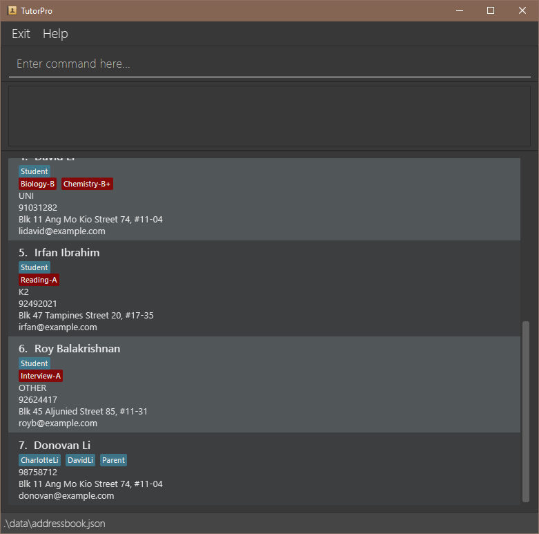

Hi Tutors! A warm welcome to our user guide, your companion for navigating and finding the full potential of TutorPro.

## Table of Contents
* [Quick start](#quick-start)
* [Features](#features)
* [FAQ](#faq)
* [Known Issues](#known-issues)
* [Command Summay](#command-summary)

--------------------------------------------------------------------------------------------------------------------

## Quick start

1. Ensure you have Java `11` or above installed in your Computer.

1. Download the latest `tutorpro.jar` from [here](https://github.com/AY2324S2-CS2103T-F12-3/tp/releases).

1. Copy the file to the folder you want to use as the _home folder_ for your TutorPro.

1. Open a command terminal, `cd` into the folder you put the jar file in, and use the `java -jar tutorpro.jar` command to run the application. 
   A GUI similar to the below should appear in a few seconds. Note how the app contains some sample data. 
   

1. Type the command in the command box and press Enter to execute it. e.g. typing **`help`** and pressing Enter will open the help window. 
   Some example commands you can try:

   * `list` : Lists all contacts.

   * `add n/John Doe p/98765432 e/johndoe@gmail.com a/Clementi Ave 123, Blk 321, #12-345 lvl/P5 sub/math-B sub/science-C` : Adds a contact named `John Doe` to your list of contacts.

   * `find John` : Finds all contacts with names containing the word 'John'.

   * `clear` : Deletes all contacts.

   * `exit` : Exits the app.

1. Refer to the [Features](#features) below for details of each command.

--------------------------------------------------------------------------------------------------------------------

## Features

**:information_source: Notes about the command format:** 

* Words in `UPPER_CASE` are the parameters to be supplied by the user. 
  E.g. in `add STUDENT_NAME`, `STUDENT_NAME` is a parameter which can be used as `add John Doe`.

* Items in square brackets are optional. 
  e.g `n/NAME [t/TAG]` can be used as `n/John Doe t/friend` or as `n/John Doe`.

* Items with `…`​ after them can be used multiple times including zero times. 
  Items with … after them can be used multiple times.
  E.g. `sub/SUBJECT-GRADE…` can be used as `sub/math-B`(i.e. 1 time), `sub/math-B sub/science-C`(i.e. 2 times), etc.

* Extraneous parameters for commands that do not take in parameters (such as `help`, `list`, `exit` and `clear`) will be ignored. 
  e.g. if the command specifies `help 123`, it will be interpreted as `help`.

* If you are using a PDF version of this document, be careful when copying and pasting commands that span multiple lines as space characters surrounding line-breaks may be omitted when copied over to the application.

### Adding new Students: `add`

Add a new student with their details to your TutorPro list.

Format: `add n/STUDENT_NAME p/PHONE_NUMBER e/EMAIL_ADDRESS a/ADDRESS lvl/EDUCATION_LEVEL sub/SUBJECT-GRADE…  `

:bulb: **Tip:**
A student can have 1 or more subjects.

Examples:
* `add n/John Doe p/98765432 e/johndoe@gmail.com a/Clementi Ave 123, Blk 321, #12-345 lvl/P5 sub/math-B sub/science-C`
* `add n/Jany Doh p/97862354 e/janydoh@email.com a/Changi St 79, Blk 12, #03-456 lvl/S5 sub/english-B`

:bulb: **Caution:**
Below are some constraints to follow when inputting parameters.

Constraints:
* For `STUDENT_NAME`, capitalization (e.g. `jOhN DoE`) or extra/leading/trailing spaces does not affect the value (e.g. `John     Doe`). The NAME should not have special characters (e.g. `#`, `@`, `!` etc.).
* For `PHONE_NUMBER`, the input must be an 8-digit number
* For `EDUCATION_LEVEL`, the input must not contain special characters
* For `SUBJECT-GRADE`, the input must not contain special characters.
  * Note: `SUBJECT` refers to the subject the student is receiving tuition for, while `GRADE` refers to the grade the student obtained for their most recent test on that subject.
  * E.g. `math-B` indicates that the student is receiving tuition for Mathematics, and obtained a B grade for their most recent test for Mathematics.
* If any parameter is invalid, its respective error message will be printed.

### Editing a Student's details : `edit`

Edit and/or update a particular student’s details/progress.

Format: `edit STUDENT_NAME cat/CATEGORY new/NEW_INFORMATION`

Examples:
*  `edit John Doe cat/sub new/math-A` Edits the subject John Doe is being tutored for and his grade to `Math` and `A` respectively.
*  `edit Jany Doh cat/lvl new/s2` Edits the education level of Jany Doh to `S2`.

:bulb: **Caution:**
Below are some constraints to follow when inputting parameters.

Constraints:
* For `STUDENT_NAME`, capitalization (e.g. `jOhN DoE`) or extra/leading/trailing spaces does not affect the value (e.g. `John     Doe`). The NAME should not have special characters (e.g. `#`, `@`, `!` etc.).
* For `CATEGORY`, the input must be one of the following:
  * `name`, `sub`, `number`, `address` or `lvl`
* For `NEW_INFORMATION`, the input format depends on the category
  * For `name`, the input should not contain special characters (e.g. `#`, `@`, `!` etc).
  * For `sub`, the input must follow the format `SUBJECT-GRADE`, as explained in the add command above.
  * For `lvl`, the input must not contain special characters (e.g. `#`, `@`, `!` etc).
  * For `num`, the input must be an 8-digit number.
* If any parameter is invalid, its respective error message will be printed.

### Deleting existing Students : `delete`

Deletes the specified student from your list of contacts.

To delete a student from your list, type in the `delete` command and a list of matching contacts will show up. Then, choose the correct contact that you wish to delete from the list.

Format:
1. `delete STUDENT_NAME` → a list of matching contacts will appear and TutorPro will prompt you for input again.
2. `LIST_NUMBER` → the contact at the specified list number will be deleted.

* Deletes the person at the specified `INDEX`.
* The index refers to the index number shown in the displayed person list.
* The index **must be a positive integer** 1, 2, 3, …​

Example:
* User input 1: `delete John`
  *     Output: 1. John Doe, 98765432, Clementi Ave 123…, P5, Math-B
                2. Johnny, 91234567, Jurong…, P5, Science-B
                3. Johnsy Boy, 83947237, <address>..., P3, English-C

* User input 2: `3` → Johnsy Boy will be deleted.

:bulb: **Caution:**
Below are some constraints to follow when inputting parameters.

Constraints:
* For `STUDENT_NAME`, capitalization (e.g. `jOhN DoE`) or extra/leading/trailing spaces does not affect the value (e.g. `John     Doe`). The NAME should not have special characters (e.g. `#`, `@`, `!` etc.).
* For `LIST_NUMBER`, the input must be a number not greater than the size of the list.
  * E.g. if the list contains 3 people, inputting `4` will print an error message.
* If any parameter is invalid, its respective error message will be printed.

### Finding certain Students: `find`

Find a list of students matching the user input.

Format: `find STUDENT_NAME`

Examples:
* `find John Doe`
* `find john`
* `find dOE`

:bulb: **Caution:**
Below are some constraints to follow when inputting parameters.

Constraints:
* For `STUDENT_NAME`, capitalization (e.g. `jOhN DoE`) or extra/leading/trailing spaces does not affect the value (e.g. `John     Doe`). The NAME should not have special characters (e.g. `#`, `@`, `!` etc.).
* If any parameter is invalid, its respective error message will be printed.

### Adding events `event`

Add events to your schedule..

Format: `event n/NAME at/TIME h/HOURS [t/TAG]...`

Examples:
* `event n/Bob math tutoring at/2024-03-04 12:00 h/2 t/math t/tutoring`
* `event n/John Doe science tutoring at/2024-10-10 h/1`

:bulb: **Caution:**
Below are some constraints to follow when inputting parameters.

Constraints:
* For `TIME`, the input should follow the format of `YYYY-MM-DD HH:mm`.
* If any parameter is invalid, its respective error message will be printed.

### Setting reminders `remind`

Set reminders for important deadlines or milestones(e.g. O-Levels, A-Levels).

Format: `remind n/DESCRIPTION at/TIME t/TAG`

Example:
* `remind n/Bob uni app deadline at/2024-03-04 12:00 t/urgent`

:bulb: **Caution:**
Below are some constraints to follow when inputting parameters.

Constraints:
* For `TIME`, the input should follow the format of `YYYY-MM-DD HH:mm`.
* If any parameter is invalid, its respective error message will be printed.

### Displaying your schedule `schedule`
Lists out events and reminders that occur in the incoming specified number of days.
If no number of days is specified, events and reminders that occur in the next 14 days will be listed.

Format: `schedule [NUMBER_OF_DAYS]`

Example:
* `schedule 10`
Displays your schedule (consisting of all your events and reminders) for the next 10 days.
* `schedule`
Displays your schedule for the next 14 days.

:bulb: **Caution:**
Below are some constraints to follow when inputting parameters.

Constraints:
* For `NUMBER_OF_DAYS`, the input should be a positive whole number.
* If any parameter is invalid, its respective error message will be printed.

### Clearing all entries : `clear`

Clears all entries from your TutorPro list.

Format: `clear`

### Listing all persons : `list`

Shows a list of all persons in your TutorPro list.

Format: `list`

### Exiting the program : `exit`

Exits the program.

Format: `exit`

### Saving the data

TutorPro data are saved in the hard disk automatically after any command that changes the data. There is no need to save manually.

### Editing the data file

TutorPro data are saved automatically as a JSON file `[JAR file location]/data/addressbook.json`. Advanced users are welcome to update data directly by editing that data file.

:exclamation: **Caution:**
If your changes to the data file makes its format invalid, TutorPro will discard all data and start with an empty data file at the next run. Hence, it is recommended to take a backup of the file before editing it. 
Furthermore, certain edits can cause TutorPro to behave in unexpected ways (e.g., if a value entered is outside of the acceptable range). Therefore, edit the data file only if you are confident that you can update it correctly.

--------------------------------------------------------------------------------------------------------------------

## FAQ

**Q**: How do I transfer my data to another Computer? 
**A**: Install the app in the other computer and overwrite the empty data file it creates with the file that contains the data of your previous AddressBook home folder.

--------------------------------------------------------------------------------------------------------------------

## Known issues

1. **When using multiple screens**, if you move the application to a secondary screen, and later switch to using only the primary screen, the GUI will open off-screen. The remedy is to delete the `preferences.json` file created by the application before running the application again.

--------------------------------------------------------------------------------------------------------------------

## Command summary

 Action       | Format, Examples                                                                                                                                                                                                 
--------------|------------------------------------------------------------------------------------------------------------------------------------------------------------------------------------------------------------------
 **Add**      | `add STUDENT_NAME p/PHONE_NUMBER a/ADDRESS lvl/EDUCATION_LEVEL sub/SUBJECT-GRADE… `   e.g., `add John Doe p/98765432 e/johndoe@gmail.com a/Clementi Ave 123, Blk 321 #10-234 lvl/p5 sub/Math-B sub/Science-B` 
 **Clear**    | `clear`                                                                                                                                                                                                          
 **Delete**   | Step 1) `delete STUDENT_NAME`   * E.g. `delete John` (Outputs list of students with matching names)   Step 2) `LIST_NUMBER`   * E.g. `3` (Deletes 3rd person in the list)                               
 **Edit**     | `edit INDEX [n/NAME] [p/PHONE_NUMBER] [e/EMAIL] [a/ADDRESS] [t/TAG]…​`  e.g.,`edit 2 n/James Lee e/jameslee@example.com`                                                                                      
 **Find**     | `find KEYWORD [MORE_KEYWORDS]`  e.g., `find James Jake`                                                                                                                                                       
 **List**     | `list`                                                                                                                                                                                                           
 **Help**     | `help`                                                                                                                                                                                                           
| **Event**    | `event n/NAME at/TIME h/HOURS [t/TAG]...`   e.g. `event n/John Doe science tutoring at/2024-10-10 h/1`                                                                                                        |
| **Remind**   | `remind n/DESCRIPTION at/TIME t/TAG`   e.g. `remind n/Bob uni app deadline at/2024-03-04 12:00 t/urgent`                                                                                                      |
| **Schedule** | `schedule [NUMBER_OF_DAYS]`    e.g. `schedule 10`                                                                                                                                                                          |

